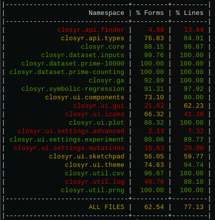

# closyr

[](https://github.com/ogeagla/closyr/actions/workflows/clojure.yml)


A Symbolic Regression tool to search for symbolic expressions which minimize residuals to an objective, written in Clojure.


Warning: This is experimental software, with an unstable API. Expect breaking changes prior to a major release.

- Draw an objective function, select a built-in dataset, or provide a CSV
- Select number of points, iterations
- See progress 
  - Chart of best fitting function
  - Chart of loss over time
  - A selectable text version of the function

## Installation


Run the application from binary, download a release JAR and see the Usage section below.  
This project is not yet available in a JAR repository (though I'd use Clojars if enough requests).


Or, you can run the app from source, using Clojure development tools (`leiningen`) in this project:

    $ lein deps/repl/run/uberjar...

## Usage

Use the application via GUI or in the terminal. 

There are 4 ways to run the application.  See next section for details about the options you can provide when running the app.


### Run the provided release JAR

Requirements: Java, Leiningen

    $ lein uberjar
    $ java -jar closyr-0.1.0-SNAPSHOT-standalone.jar ...options here...


### Lein Run

Requirements: Java, Leiningen


    $ lein run

Or headless (just in the terminal), where you can specify options and input data:

    $ lein run -t -p 25 -i 5 -x 0,1,2,3,4,5,6 -y 1,2,30,4,5,6,10

Which is the same as:

    $ lein run --headless --population 1000 --iterations 200 --xs 0,1,2,3,4,5,6 --ys 1,2,30,4,5,6,10 

###  In Clojure REPL

Requirements: Java, Leiningen (I will provide a deps file if enough interest)


    (require '[closyr.symbolic-regression :as symreg])
    (symreg/run-app-with-gui)

### Build and run JAR

Requirements: Java, Leiningen


    $ lein uberjar
    $ java -jar target/uberjar/closyr-0.1.0-SNAPSHOT-standalone.jar

You can also provide the same command-line options to `java` command, like:

    $ java -jar target/uberjar/closyr-0.1.0-SNAPSHOT-standalone.jar -t -p 25 -i 5 -x 0,1,2,3,4,5,6 -y 1,2,30,4,5,6,10

### Run as Web Application

You can run closyr as a web application with a browser-based UI that includes real-time progress updates via Server-Sent Events (SSE).

Requirements: Java, Leiningen

Start the web server on the default port (3000):

    $ lein run --web

Or specify a custom port:

    $ lein run --web 8080

Then open your browser to http://localhost:3000 (or your custom port).

The web interface provides:
- **Input data entry**: Enter X and Y values as comma-separated numbers
- **CSV file upload**: Upload a CSV file with x,y data points
- **Built-in datasets**: Choose from preset datasets (quadratic, cubic, sine, etc.)
- **Configuration**: Set iterations, population size, max expression size, and random seed
- **Real-time progress**: Watch the solver evolve formulas with live updates
- **Results display**: View the best formula found along with alternative solutions

#### Web API

The web application also exposes a JSON API for programmatic access:

```bash
# Start a solver job
curl -X POST http://localhost:3000/api/solve \
  -H "Content-Type: application/json" \
  -d '{"xs": [1,2,3,4,5], "ys": [1,4,9,16,25], "config": {"iterations": 20, "population": 50}}'

# Response: {"jobId": "uuid-here", "eventsUrl": "/api/jobs/uuid-here/events"}

# With adaptive mode and quiet logs
curl -X POST http://localhost:3000/api/solve \
  -H "Content-Type: application/json" \
  -d '{"xs": [1,2,3,4,5], "ys": [1,4,9,16,25], "config": {"iterations": 100, "population": 200, "adaptiveMode": true, "quietLogs": true}}'

# Check job status
curl http://localhost:3000/api/jobs/{jobId}

# Stream progress updates (SSE)
curl http://localhost:3000/api/jobs/{jobId}/events

# List available datasets
curl http://localhost:3000/api/datasets

# Parse CSV content
curl -X POST http://localhost:3000/api/upload-csv \
  -H "Content-Type: application/json" \
  -d '{"content": "x,y\n1,1\n2,4\n3,9"}'
```

## Options
| Short, Long Option      | Required?       | Example | Default | Description                                                                                                                   |
|-------------------------|-----------------|---------|---------|-------------------------------------------------------------------------------------------------------------------------------|
| `--web`                 | no              | `--web 3000` | `3000` | start HTTP web server instead of GUI on specified port                                                                   |
| `-t`,`--headless`       | no              | `-t`    | `false` | run without GUI, in terminal only                                                                                             |
| `-c`,`--use-flamechart` | no              | `-c`    | `false` | run with flamecharts, run then visit http://localhost:54321/flames.svg                                                        |
| `-p`,`--population`     | no              | `100`   | `20`    | size of population which will evolve; the number of functions we create and modify                                            |
| `-i`,`--iterations`     | no              | `50`    | `10`    | number of iterations to run for                                                                                               |
| `-l`,`--max-leafs`      | no              | `40`    | `40`    | max number of AST tree leafs in candidate functions                                                                           |
| `-x`,`--xs`             | no, unless `ys` | `1,3,4` | random  | the xs for the points in the dataset to fit against; if provided, must also provide `ys` and be the same count                |
| `-y`,`--ys`             | no, unless `xs` | `2,4,8` | random  | the ys for the points in the dataset to fit against; if provided, must also provide `xs` and be the same count                |
| `-f`,`--infile`         | no              | `f.csv` |         | A CSV file. Contains either 2 columns without titles in first row, or has columns `x` and `y` to be used as objective dataset |
| `-s`,`--seed`           | no              | `42`    |         | Random seed for reproducible results. **Warning:** Enables deterministic mode which disables CPU parallelism                  |
| `-w`,`--mutations-whitelist` | no         | `+Sin,-Sin` |     | Comma-separated list of mutation labels to use (only these mutations will be applied)                                         |
| `-b`,`--mutations-blacklist` | no         | `Derivative` |    | Comma-separated list of mutation labels to exclude                                                                            |
| `-a`,`--adaptive`       | no              | `-a`    | `false` | Enable adaptive mutation rates that adjust based on population diversity and stagnation                                       |
| `-q`,`--quiet`          | no              | `-q`    | `false` | Suppress detailed iteration logs (quiet mode)                                                                                 |
| `--cache`               | no              | `--cache` | `false` | Enable evaluation cache to avoid redundant score calculations for identical expressions                                      |
| `--scoring`             | no              | `--scoring r-squared` | `mae-max` | Scoring method: `mae-max` (default), `log-cosh`, or `r-squared`                                                    |

### Reproducible Results with Random Seed

You can use the `-s` or `--seed` option to get reproducible results:

    $ lein run -t -p 20 -i 5 -x 1,2,3,4,5 -y 2,4,6,8,10 -s 42

Running the same command with the same seed will produce identical results.

**Warning:** When a random seed is set, the solver enters **deterministic mode** which disables CPU parallelism. This ensures reproducibility but may result in slower execution times for large populations.

### Filtering Mutations with Whitelist/Blacklist

You can control which mutations are used during evolution using whitelist and blacklist options:

```bash
# Only use trigonometric mutations
$ lein run -t -p 100 -i 50 -x 1,2,3,4,5 -y 2,4,6,8,10 -w "+Sin,-Sin,+Cos,-Cos,*Sin,*Cos"

# Exclude derivative and logarithm mutations
$ lein run -t -p 100 -i 50 -x 1,2,3,4,5 -y 2,4,6,8,10 -b "Derivative,+Log,-Log"

# Combine both: start with trig mutations, exclude +Sin
$ lein run -t -p 100 -i 50 -x 1,2,3,4,5 -y 2,4,6,8,10 -w "+Sin,-Sin,+Cos,-Cos" -b "+Sin"
```

Common mutation labels include: `Derivative`, `+Sin`, `-Sin`, `+Cos`, `-Cos`, `*Sin`, `*Cos`, `+Log`, `-Log`, `+Exp`, `-Exp`, `+x`, `-x`, `*x`, `/x`, `+1/2`, `-1/2`, `*2`, `/2`, and many more.

### Adaptive Mutation Rates

The `-a` or `--adaptive` flag enables adaptive mutation rates. When enabled, the solver dynamically adjusts:

- **Mutation vs Crossover ratio**: Increases mutation rate when population diversity is low or when progress stagnates
- **Mutation count per individual**: Applies more mutations when stuck in local optima

```bash
# Run with adaptive mutation rates
$ lein run -t -p 200 -i 100 -x 1,2,3,4,5 -y 1,4,9,16,25 -a

# Combine with quiet mode for cleaner output
$ lein run -t -p 200 -i 100 -x 1,2,3,4,5 -y 1,4,9,16,25 -a -q
```

The adaptive system tracks:
- **Population diversity**: Score spread between best and median individuals
- **Stagnation**: Iterations without fitness improvement
- **History**: Recent best scores to detect convergence trends

When the population converges (low diversity) or stagnates (no improvement for several iterations), the system automatically increases exploration by raising mutation rates and applying more mutations per individual.

### Evaluation Cache

The `--cache` flag enables caching of evaluation results by expression string. When the same expression appears multiple times (which is common during evolution), cached scores are returned instead of re-computing them.

```bash
# Run with evaluation cache enabled
$ lein run -t -p 200 -i 100 -x 1,2,3,4,5 -y 1,4,9,16,25 --cache

# Combine with adaptive mode
$ lein run -t -p 200 -i 100 -x 1,2,3,4,5 -y 1,4,9,16,25 -a --cache
```

The cache is most beneficial when:
- Using larger populations where duplicate expressions are more likely
- Running many iterations where expressions may recur
- Using deterministic mode (with `--seed`) where the same mutations may produce the same results

The cache is cleared at the start of each run. In the GUI and webapp interfaces, the evaluation cache option is available in the Advanced Settings.

### Scoring Methods

The `--scoring` option allows you to choose different fitness scoring methods. All methods return 0 for a perfect fit, with more negative values indicating worse fits.

```bash
# Use R² scoring (coefficient of determination)
$ lein run -t -p 100 -i 50 -x 1,2,3,4,5 -y 1,4,9,16,25 --scoring r-squared

# Use log-cosh scoring (robust to outliers)
$ lein run -t -p 100 -i 50 -x 1,2,3,4,5 -y 1,4,9,16,25 --scoring log-cosh

# Use default MAE scoring
$ lein run -t -p 100 -i 50 -x 1,2,3,4,5 -y 1,4,9,16,25 --scoring mae-max
```

Available scoring methods:

| Method | Description |
|--------|-------------|
| `mae-max` | Default. Negative of (2×MAE + max residual). Penalizes both average error and worst-case outliers. |
| `log-cosh` | Log-cosh loss. Smooth like MSE for small errors, robust like MAE for large errors. No hyperparameter tuning needed. |
| `r-squared` | R² coefficient of determination minus 1. Perfect fit = 0, predictions at mean = -1, worse predictions < -1. |

**Choosing a scoring method:**
- Use `mae-max` (default) for general-purpose symbolic regression
- Use `log-cosh` when your data may have outliers but you still want smooth gradients for small errors
- Use `r-squared` when you want to measure how well the expression explains variance in the data

## Q + A

- `How do I run multiple jobs concurrently?` : Open a new tab with the webapp, or run another GUI, or open another terminal.  The app does not inherently support concurrent jobs, from UI perspective.

## Example Screenshots

On successful application start, you can start and run a search.  You might see something like this when done:


An example of using the GUI:


## Tests

    $ lein test

Coverage looks like this if you run `lein cloverage`:



## Benchmarks

Inspired by https://github.com/omron-sinicx/srsd-benchmark

The project includes benchmark tests using standard symbolic regression test functions from the literature:

### Running Benchmarks

```bash
# Run all benchmark tests
$ lein test :only closyr.benchmark-functions-test

# Run a specific benchmark
$ lein test :only closyr.benchmark-functions-test/nguyen-4-benchmark
```

### Benchmark Functions

| Benchmark | Formula | Domain | Description |
|-----------|---------|--------|-------------|
| **Nguyen-4** | x⁶ + x⁵ + x⁴ + x³ + x² + x | [-1, 1] | High-degree polynomial |
| **Nguyen-5** | sin(x²)·cos(x) - 1 | [-1, 1] | Trigonometric composition |
| **Feynman Lorentz** | 1/√(1 - v²/c²) | [0, 0.95] | Relativistic Lorentz factor |
| **Feynman Wave** | sin(kx - ωt) | [0, 4π] | Traveling wave equation |

These benchmarks are from the [Nguyen benchmark suite](https://gpbenchmarks.org/) and [AI Feynman dataset](https://space.mit.edu/home/tegmark/aifeynman.html), commonly used in symbolic regression research.

### Example Results

Results from running benchmarks with 200 population, 100 iterations, seed=42:

| Benchmark        | Best Score | Time  | Best Formula Found |
|------------------|------------|-------|-------------------|
| Nguyen-4         | -0.91      | 4.91s | `-1/100+Sin(x)+x*(x+1/50*x*Csc(x)*(-1/100+E^(2*(-1/10+E)^x)-11/10*Sin(121.0*x)))` |
| Nguyen-5         | -0.29      | 2.00s | `-9601/10000` |
| Feynman Lorentz  | -0.72      | 2.67s | `1/2+x-Cos(x)+Cos(1/2-x)*(-x^2+0.9*Log(-1/100+3.05997*x^4+Cos(x)))` |
| Feynman Wave     | -0.14      | 2.37s | `-Cos(3/5+x)` |

*Score is negative sum of residuals (closer to 0 is better). Times measured on AMD Ryzen 9.*

**Note:** Benchmarks use deterministic mode (random seed) for reproducibility, which disables parallelism. Production runs without a seed will be faster.

## How It Works

- We use Genetic Algorithms to allow candidate functions of best fit to compete.
- They compete on a computed score on the input data, and we use the sum of residuals to generate the score.
- Evolution consists of mutation and crossover. 
- Mutations act on the function's AST and modify branches, leafs, or the whole tree.  Operations like `+0.1`, `*x`, `/Sin(x)` are applied to functions.
- Crossovers combine two functions' ASTs at a random point, and combine using various operators like `+`, and `*`.

### Java API

You can use closyr as a library from Java or any JVM language. The Java API provides a clean interface layered on top of the Clojure implementation:

```
┌─────────────────────────────────────────────────────────────────────────┐
│                           Your Java Application                         │
└─────────────────────────────────────────────────────────────────────────┘
                                    │
                                    ▼
┌─────────────────────────────────────────────────────────────────────────┐
│                        Java API (org.closyr.api)                        │
│  ┌─────────────────┐  ┌──────────────────┐  ┌────────────────────────┐  │
│  │  FormulaFinder  │  │  FormulaConfig   │  │  IFormulaResult        │  │
│  │  .find(xs, ys)  │  │  .iterations()   │  │  .getBestSolution()    │  │
│  │  .create()      │  │  .populationSize │  │  .getAllSolutions()    │  │
│  │                 │  │  .randomSeed()   │  │  .getIterationsRun()   │  │
│  └─────────────────┘  └──────────────────┘  └────────────────────────┘  │
└─────────────────────────────────────────────────────────────────────────┘
                                    │
                                    ▼
┌─────────────────────────────────────────────────────────────────────────┐
│                    Clojure Implementation Layer                         │
│  ┌─────────────────────────────────────────────────────────────────┐    │
│  │  closyr.api.finder  ──▶  closyr.symbolic-regression             │    │
│  │         │                         │                             │    │
│  │         ▼                         ▼                             │    │
│  │  closyr.api.types        closyr.ga (genetic algorithm)          │    │
│  │                                   │                             │    │
│  │                                   ▼                             │    │
│  │                          closyr.ops (mutations/crossover)       │    │
│  │                                   │                             │    │
│  │                                   ▼                             │    │
│  │                          Symja (symbolic math engine)           │    │
│  └─────────────────────────────────────────────────────────────────┘    │
└─────────────────────────────────────────────────────────────────────────┘
```

#### Java Usage Example

```java
import org.closyr.api.*;

public class Example {
    public static void main(String[] args) {
        // Input data points
        double[] xs = {1.0, 2.0, 3.0, 4.0, 5.0};
        double[] ys = {2.0, 4.0, 6.0, 8.0, 10.0};

        // Simple usage with defaults
        IFormulaResult result = FormulaFinder.find(xs, ys);

        // Or with custom configuration
        IFormulaConfig config = FormulaConfigBuilder.builder()
            .iterations(50)
            .populationSize(100)
            .maxLeafs(40)
            .randomSeed(42)  // Optional: for reproducible results
            .build();

        result = FormulaFinder.find(xs, ys, config);

        // Get the best formula found
        IFormulaSolution best = result.getBestSolution();
        System.out.println("Formula: " + best.getFormula());
        System.out.println("Score: " + best.getScore());
    }
}
```

#### Reproducible Results in Java

Use `randomSeed()` in the config builder for reproducible results:

```java
IFormulaConfig config = FormulaConfigBuilder.builder()
    .iterations(20)
    .populationSize(50)
    .randomSeed(12345)  // Same seed = same results
    .build();
```

**Warning:** Setting a random seed enables **deterministic mode** which disables CPU parallelism. This ensures reproducibility but may result in slower execution.

#### Adaptive Mutation Rates in Java

Enable adaptive mutation rates to dynamically adjust exploration based on population diversity:

```java
IFormulaConfig config = FormulaConfigBuilder.builder()
    .iterations(100)
    .populationSize(200)
    .adaptiveMode(true)   // Enable adaptive mutation rates
    .quietLogs(true)      // Optional: suppress detailed iteration logs
    .build();

IFormulaResult result = FormulaFinder.find(xs, ys, config);
```

When adaptive mode is enabled, the solver automatically:
- Increases mutation rates when population diversity is low
- Applies more mutations per individual when progress stagnates
- Reduces mutation intensity when making steady progress

#### Filtering Mutations in Java

Use `mutationsWhitelist()` and `mutationsBlacklist()` to control which mutations are used:

```java
// Only use trigonometric mutations
IFormulaConfig config = FormulaConfigBuilder.builder()
    .iterations(50)
    .populationSize(100)
    .mutationsWhitelist("+Sin", "-Sin", "+Cos", "-Cos", "*Sin", "*Cos")
    .build();

// Exclude specific mutations
IFormulaConfig config = FormulaConfigBuilder.builder()
    .iterations(50)
    .populationSize(100)
    .mutationsBlacklist("Derivative", "+Log", "-Log")
    .build();

// Or using FindFormula.Config directly
FindFormula.Config config = new FindFormula.Config()
    .iterations(50)
    .populationSize(100)
    .mutationsWhitelist("+Sin", "-Sin", "+Cos", "-Cos")
    .mutationsBlacklist("+Sin");  // Further exclude from whitelist
```

#### Scoring Methods in Java

Choose different fitness scoring methods using `scoringMethod()`:

```java
// Use R² scoring (coefficient of determination)
FindFormula.Config config = new FindFormula.Config()
    .iterations(50)
    .populationSize(100)
    .scoringMethod("r-squared");

// Use log-cosh scoring (robust to outliers)
FindFormula.Config config = new FindFormula.Config()
    .iterations(50)
    .populationSize(100)
    .scoringMethod("log-cosh");

// Use default MAE scoring (explicitly)
FindFormula.Config config = new FindFormula.Config()
    .iterations(50)
    .populationSize(100)
    .scoringMethod("mae-max");

// Or with FormulaConfigBuilder
IFormulaConfig config = FormulaConfigBuilder.builder()
    .iterations(50)
    .populationSize(100)
    .scoringMethod("r-squared")
    .build();
```

Available scoring methods:
- `mae-max` (default): Negative of (2×MAE + max residual). Penalizes both average error and worst-case outliers.
- `log-cosh`: Log-cosh loss. Smooth like MSE for small errors, robust like MAE for large errors.
- `r-squared`: R² coefficient of determination minus 1. Perfect fit = 0, worse predictions are more negative.

## Architecture

```
┌─────────────────────────────────────────────────────────────────────────────────┐
│                              ENTRY POINTS                                       │
├─────────────────────┬─────────────────────┬─────────────────────────────────────┤
│   closyr.core       │  closyr.api.finder  │  closyr.symbolic-regression         │
│   (CLI -main)       │  (Java API)         │  (Main Orchestrator)                │
└─────────┬───────────┴──────────┬──────────┴──────────────┬──────────────────────┘
          │                      │                         │
          └──────────────────────┼─────────────────────────┘
                                 ▼
┌─────────────────────────────────────────────────────────────────────────────────┐
│                           GENETIC ALGORITHM                                     │
│  ┌─────────────────────────────────────────────────────────────────────────┐    │
│  │                           closyr.ga                                     │    │
│  │            (Selection, Crossover, Mutation Loop)                        │    │
│  └─────────────────────────────────────────────────────────────────────────┘    │
└───────────────────────────────────┬─────────────────────────────────────────────┘
                                    ▼
┌─────────────────────────────────────────────────────────────────────────────────┐
│                         EXPRESSION OPERATIONS                                   │
│  ┌───────────────┐    ┌───────────────┐    ┌───────────────┐                    │
│  │  closyr.ops   │───▶│ ops.modify    │    │ ops.eval      │                    │
│  │   (Facade)    │    │ (Mutations &  │    │ (Evaluate     │                    │
│  │               │───▶│  Crossover)   │    │  Expressions) │                    │
│  └───────┬───────┘    └───────────────┘    └───────────────┘                    │
│          │            ┌───────────────┐    ┌───────────────┐                    │
│          └───────────▶│ ops.initialize│    │ ops.common    │                    │
│                       │ (Population   │    │ (Shared Utils)│                    │
│                       │  Seeding)     │    │               │                    │
│                       └───────────────┘    └───────────────┘                    │
└───────────────────────────────────┬─────────────────────────────────────────────┘
                                    ▼
┌─────────────────────────────────────────────────────────────────────────────────┐
│                         SYMJA (External)                                        │
│              Symbolic Math Engine - AST Manipulation & Evaluation               │
│                    github.com/axkr/symja_android_library                        │
└─────────────────────────────────────────────────────────────────────────────────┘

┌─────────────────────────────────────────────────────────────────────────────────┐
│                              UI LAYER                                           │
│  ┌─────────────────────────┐    ┌─────────────────┐    ┌─────────────────┐      │
│  │     closyr.ui.gui       │    │  closyr.ui.plot │    │ closyr.ui.icons │      │
│  │   (Swing/Seesaw GUI)    │───▶│   (XChart)      │    │                 │      │
│  │   - Sketchpad           │    │   - Best Fn     │    │                 │      │
│  │   - Controls            │    │   - Scores      │    │                 │      │
│  │   - Function Display    │    │                 │    │                 │      │
│  └─────────────────────────┘    └─────────────────┘    └─────────────────┘      │
│                                                                                 │
│  ┌─────────────────────────────────────────────────────────────────────────┐    │
│  │                         WEB LAYER (--web mode)                          │    │
│  │  ┌───────────────┐  ┌───────────────┐  ┌───────────────┐                │    │
│  │  │ web.server    │  │ web.routes    │  │ web.sse       │                │    │
│  │  │ (Jetty)       │  │ (Reitit)      │  │ (SSE Stream)  │                │    │
│  │  └───────────────┘  └───────────────┘  └───────────────┘                │    │
│  │  ┌───────────────┐  ┌───────────────┐  ┌───────────────┐                │    │
│  │  │ handlers.api  │  │ handlers.pages│  │ web.middleware│                │    │
│  │  │ (JSON API)    │  │ (Selmer HTML) │  │ (CORS, JSON)  │                │    │
│  │  └───────────────┘  └───────────────┘  └───────────────┘                │    │
│  └─────────────────────────────────────────────────────────────────────────┘    │
└─────────────────────────────────────────────────────────────────────────────────┘

┌─────────────────────────────────────────────────────────────────────────────────┐
│                            DATA LAYER                                           │
│  ┌─────────────────────────┐    ┌───────────────────────────────────────────┐   │
│  │  closyr.dataset.inputs  │    │  Built-in Datasets                        │   │
│  │  (Benchmark Functions)  │    │  - prime-10000 (nth prime)                │   │
│  │  - Nguyen-4, Nguyen-5   │    │  - prime-counting (π(x))                  │   │
│  │  - Feynman Lorentz/Wave │    │                                           │   │
│  │  - Trig, Log, Gaussian  │    │                                           │   │
│  └─────────────────────────┘    └───────────────────────────────────────────┘   │
└─────────────────────────────────────────────────────────────────────────────────┘

┌─────────────────────────────────────────────────────────────────────────────────┐
│                            UTILITIES                                            │
│  ┌───────────────┐  ┌───────────────┐  ┌───────────────┐  ┌───────────────┐     │
│  │ util.log      │  │ util.csv      │  │ util.prng     │  │ util.spec     │     │
│  │ (Logging)     │  │ (CSV Import)  │  │ (Seeded RNG)  │  │ (Malli Specs) │     │
│  └───────────────┘  └───────────────┘  └───────────────┘  └───────────────┘     │
└─────────────────────────────────────────────────────────────────────────────────┘

Data Flow:
  1. User provides (x,y) data via GUI sketchpad, CSV file, or CLI args
  2. GA creates initial population of random Symja expressions
  3. Each iteration: evaluate fitness (sum of residuals), select, mutate, crossover
  4. Best expressions shown in real-time on charts
  5. Final best-fit function returned as Symja-compatible expression
```

## Roadmap

- [x] CLI options accept a CSV file (GUI already supports this)
- [x] Web frontend with HTTP API and SSE for real-time updates
- [ ] Use something like ProGuard to shrink the JAR for releases
    - https://www.guardsquare.com/manual/configuration/examples
    - https://stackoverflow.com/questions/12281365/obfuscating-clojure-uberjars-with-proguard
    - https://github.com/eiffelqiu/obfuscate-clojure-project-demo/tree/master
- [ ] Can this be a follow-up to this issue, asking for a symbolic regression tool on the JVM? https://github.com/axkr/symja_android_library/issues/850
- [ ] When I created this and my other symbolic regression tools, I didn't know about the formal field of symbolic regression.  I've since found some great libraries that I should review and apply the lessons to this project: https://github.com/MilesCranmer/PySR

### Other TODOs

#### CLI

- [ ] CLI accepts JSON file option for input data / config, and prints results in JSON

#### Webapp

- [x] Update webapp frontend "beforeunload" handler to stop all running jobs.
- [x] Webapp / Eval cache bug: concurrent jobs using different scoring methods, when both using eval cache, share a cache and that is bad because different scoring methods result in different scores.
- [ ] Webapp / Jobs/Results/Job History: an editable text label initially populated using the text label we use in the job tabs. to be used by user to label the job with their own comments.
- [x] Webapp job config: Mutations should have some toggle-able groups in addition to selecting individuals. I want to group trig functions, exp+log, poly, analytic (derivatives, etc.), and any other obvious groups. first show the mutation groups but have a way for user to still select individual mutations.
- [ ] Webapp / Jobs, Results, Job history: show scores for all scoring methods for job results / job history but making sure to make it clear which is the job's scoring method used to find the formula. it's useful to see the functions' different scores regardless of which scoring method was used in find-formula. 
- [ ] Webapp / Job History: a better visual indicator for job score and where it ranks among job tree
- [x] Webapp / Jobs: a way to run jobs concurrently, and each running job gets its own Results area, which becomes tabbed to switch between running jobs.  This requires a new option/button like "Keep Going With Job Config" but more succinct (for each job history item), which reuses the job config/data from the job you clicked on, instead of config/data from the UI user inputs.  Each tab should have shortcuts to pause/stop the job. The existing pause / stop buttons should apply to the currently selected job in the tabs.
- [x] Webapp / Job History: a way to delete item + children of item
- [x] Webapp / Job History: add job to new tree (no parents) when input data is different and did "Keep Going". A tree should be 1 dataset.  Keep Going options should reuse x/y data from the job you clicked on.
- [x] Webapp / Job History: add a way to collapse any part of the history tree, with an expand / collapse icon is to the left of the job item.
- [x] Webapp / Job History: fix bug where if I change scoring method while a job is running, it will show in job history with the newly changed value instead of the one from the running job.
- [x] Webapp / Job Results: copy to clipboard hover btn scrolls with the formulas instead of staying in the corner, when formulas a long and have h-scroll.

#### Java GUI

- [ ] do we still want to keep a java gui around? all new functionality is going into webapp right now.

## Credits

- This project would not have been possible without the symbolic math library `Symja` (https://github.com/axkr/symja_android_library), which has been great to use and I consider it to be like a `MathJs` (https://github.com/josdejong/mathjs) on the JVM.


## Contribute

I accept PRs, please open an issue to discuss beforehand to make sure we are in alignment. Thanks!


## License

Copyright © 2024 Octavian Geagla

This program and the accompanying materials are made available under the
terms of the Eclipse Public License 2.0 which is available at
http://www.eclipse.org/legal/epl-2.0.

This Source Code may also be made available under the following Secondary
Licenses when the conditions for such availability set forth in the Eclipse
Public License, v. 2.0 are satisfied: GNU General Public License as published by
the Free Software Foundation, either version 2 of the License, or (at your
option) any later version, with the GNU Classpath Exception which is available
at https://www.gnu.org/software/classpath/license.html.

``` 
________/\\\\\\\\\__/\\\___________________/\\\\\__________/\\\\\\\\\\\____/\\\________/\\\____/\\\\\\\\\_____
 _____/\\\////////__\/\\\_________________/\\\///\\\______/\\\/////////\\\_\///\\\____/\\\/___/\\\///////\\\___
  ___/\\\/___________\/\\\_______________/\\\/__\///\\\___\//\\\______\///____\///\\\/\\\/____\/\\\_____\/\\\___
   __/\\\_____________\/\\\______________/\\\______\//\\\___\////\\\_____________\///\\\/______\/\\\\\\\\\\\/____
    _\/\\\_____________\/\\\_____________\/\\\_______\/\\\______\////\\\____________\/\\\_______\/\\\//////\\\____
     _\//\\\____________\/\\\_____________\//\\\______/\\\__________\////\\\_________\/\\\_______\/\\\____\//\\\___
      __\///\\\__________\/\\\______________\///\\\__/\\\_____/\\\______\//\\\________\/\\\_______\/\\\_____\//\\\__
       ____\////\\\\\\\\\_\/\\\\\\\\\\\\\\\____\///\\\\\/_____\///\\\\\\\\\\\/_________\/\\\_______\/\\\______\//\\\_
        _______\/////////__\///////////////_______\/////_________\///////////___________\///________\///________\///__

```
